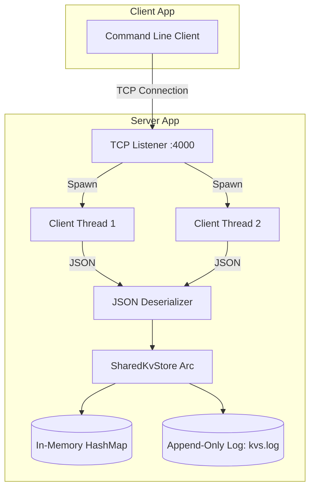

# KVS - High-Performance Key-Value Store

A fast, concurrent, and persistent key-value store built entirely from scratch in Rust. This project was developed to explore the internal mechanics of databases like Redis, focusing on speed, durability, and network architecture.

## 🚀 Features

*   **⚡ Blazing Fast Reads**: Utilizes Rust's standard `HashMap` for $O(1)$ in-memory lookups.
*   **💾 Crash-Safe Persistence**: Implements an **Append-Only Log (AOL)**. Every mutation is immediately flushed to disk (`kvs.log`), ensuring zero data loss if the server crashes.
*   **🌐 Networked Client-Server**: Runs as a standalone TCP server (`127.0.0.1:4000`), allowing remote clients to execute commands over the network.
*   **🛡️ Robust Serialization**: Uses `serde` and `serde_json` to transmit and store commands safely, handling complex strings, spaces, and special characters effortlessly.
*   **🧵 Multi-Threaded Concurrency**: Leverages `Arc` and `Mutex` to safely share the storage engine across multiple threads, allowing the server to handle concurrent connections from multiple clients simultaneously without blocking.

---

## 🧱 Architecture



---

## 🛠️ Usage

### Prerequisites
You need [Rust and Cargo](https://www.rust-lang.org/tools/install) installed on your system.

### 1. Start the Server
To start the database server, open a terminal and run:
```bash
cargo run -- server
```
*The server will boot up, replay any existing data from `kvs.log` into RAM, and listen for connections on `127.0.0.1:4000`.*

### 2. Connect via Client
Open a **new** terminal window to act as the client. You can execute the following commands:

**Set a key-value pair:**
```bash
cargo run -- set greeting "Hello, World!"
# Output: OK
```

**Get a value by key:**
```bash
cargo run -- get greeting
# Output: Hello, World!
```

**Remove a key:**
```bash
cargo run -- rm greeting
# Output: OK
```

---

## 🗄️ Storage Protocol (Under the Hood)

When a `set` or `rm` command is executed, it is serialized into a JSON string and appended as a new line to `kvs.log`.

**Example `kvs.log` contents:**
```json
{"Set":{"key":"name","value":"Sidiq"}}
{"Set":{"key":"language","value":"Rust"}}
{"Remove":{"key":"name"}}
```
On startup, the server reads this file sequentially to reconstruct the exact final state of the `HashMap` in memory.

---

## 🛣️ Future Roadmap
- [ ] **Log Compaction**: Periodically rewrite the log file to remove deleted keys and outdated values to save disk space.
- [ ] **Snapshotting**: Save the full binary state of the `HashMap` to disk to speed up recovery times on massive datasets.
