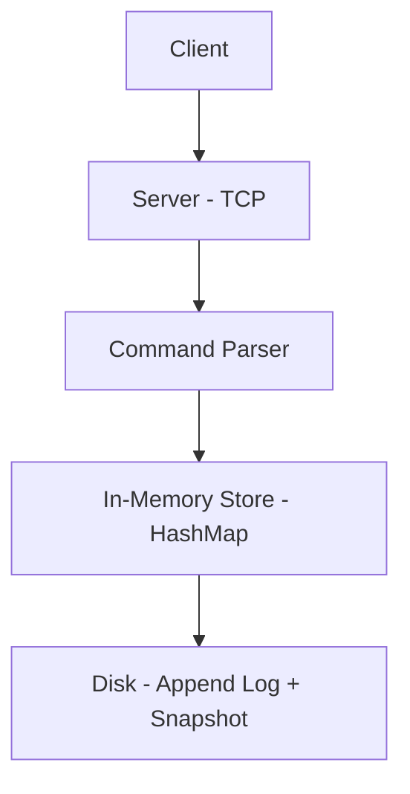

# KVS - High-Performance Key-Value Store

A fast, safe, and persistent key-value store built from scratch in Rust.

## 🧠 Core Idea

At its simplest level:
- `"username:123"` → `"Sidiq"`
- `"session:abc"` → `"{...json...}"`

You give it a key, it gives you a value. This project explores how to make this process fast, safe, and persistent.

## 🧱 Architecture



### Key Components

1.  **In-Memory Structure (Speed layer)**: Uses a `HashMap<String, String>` for $O(1)$ lookups.
2.  **Persistence (Disk storage)**: 
    -   **Append-Only Log**: Every write is saved to a log file for crash safety.
    -   **Snapshotting**: Periodic saves of the full state to speed up recovery.
3.  **Concurrency**: Thread-safe access using `RwLock` or `Mutex` to handle multiple users.
4.  **Network Layer**: A TCP server that understands a simple protocol (SET/GET).

## 🚀 Getting Started

### Prerequisites
- [Rust & Cargo](https://www.rust-lang.org/tools/install)

### Running the project
(Initial setup complete. Run `cargo run` once the first phase is implemented.)

```bash
cargo run
```
